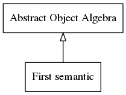

# Object Algebra: Getting Started
A simple guide to deal with Object Algebras and EMF

## Definition of the initial meta-model

1. Defining a ecore model ([expression.ecore](./expression.model/model/expression.ecore))
2. Generating the EMF Java sources from the model
3. Generating the algebra from the model (right click on the .ecore file -> Object Algebra -> Generate Object Algebra)

The result is an interface defining the abstract object algebra.

For every element with no parent (with an implicit single inheritance to EObject), a type parameter is generated. Here `A` is generated for Expression and its hierarchy.

```java
package expression.algebra;

import expression.Constant;
import expression.Expression;
import expression.Sum;

public interface ExpressionAlgebra<A> {

	A constant(final Constant constant);

	A sum(final Sum sum);

	public default A $(final Expression expression) {
		final A ret;
		if (expression.eClass().getName().equals("Constant")) {
			ret = this.constant((Constant) expression);
		} else if (expression.eClass().getName().equals("Sum")) {
			ret = this.sum((Sum) expression);
		} else {
			throw new RuntimeException("Unknow Expression " + expression);
		}
		return ret;
	}
}
```

## Definition of a first semantic



1. Definition of a concret interface of the abstract type `A`

```java
package expression.evaluate;

public interface EvaluateOperation {
	int evaluate();
}
```

2. Integration of the `EvaluateOperation` on an implementation of the abstract algebra

```java
package expression.evaluate;

import expression.*;
import expression.algebra.ExpressionAlgebra;

public interface ExpressionEvaluate extends ExpressionAlgebra<EvaluateOperation> {

	@Override
	default EvaluateOperation constant(final Constant constant) {
		return new EvaluateOperation() {
			@Override
			public int evaluate() {
				return constant.getValue();
			}
		};
	}

	@Override
	default EvaluateOperation sum(final Sum sum) {
		return new EvaluateOperation() {

			@Override
			public int evaluate() {
				return $(sum.getLeft()).evaluate() + $(sum.getRight()).evaluate();
			}
		};
	}

}
```


