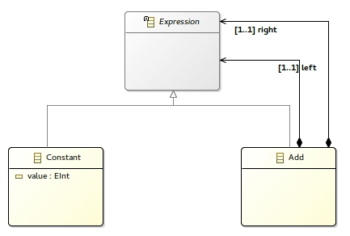

# Object Algebra: Getting Started
A simple guide to deal with Object Algebras and EMF

## Definition of the initial metamodel



1. Definition of an Ecore model ([expression.ecore](./expression.model/model/expression.ecore))
2. Generation the EMF Java sources from the model
3. Generation of the algebra from the model (right click on the .ecore file -> Object Algebra -> Generate Object Algebra).

The last step results in an interface defining the abstract object algebra. For every element with no parent (with an implicit single inheritance to EObject), a type parameter is generated. For more details: [TypeParameters.md](./TypeParameters.md)

Here `A` is generated for Expression and its hierarchy.

```java
package expression.algebra;

import expression.Add;
import expression.Constant;
import expression.Expression;

public interface ExpressionAlgebra<A> {

	A constant(final Constant constant);

	A add(final Add sum);

	default A $(final Expression expression) {
		if (expression instanceof Constant) {
			return this.constant((Constant) expression);
		} else if (expression instanceof Add) {
			return this.add((Add) expression);
		} else {
			throw new RuntimeException("Unknow Expression " + expression);
		}
	}
}
```

## Definition of a first semantics: Evaluate


Definition of a semantic type for the semantic type parameter `A`.

```java
package expression.evaluate;

public interface EvaluateOperation {
	int evaluate();
}
```

Integration of the `EvaluateOperation` on an implementation of the abstract algebra.
Each element of the metamodel must return an implementation of the semantic type of the object algebra, modelized by an interface.

In order to step into the semantics of a related part of the model, the `$` method is used.

For instance l.24 the `sum` semantics delegates the evaluation of the `left` and `right` sub-part of the expression the each of them respectively and then proceed to the sum of both results.

For more details about the `$` methods: [Dollars.md](./Dollars.md)

```java
package expression.evaluate;

import expression.Add;
import expression.Constant;
import expression.algebra.ExpressionAlgebra;

public interface ExpressionEvaluate extends ExpressionAlgebra<EvaluateOperation> {

	@Override
	default EvaluateOperation constant(final Constant constant) {
		return new EvaluateOperation() {
			@Override
			public int evaluate() {
				return constant.getValue();
			}
		};
	}

	@Override
	default EvaluateOperation add(final Add sum) {
		return new EvaluateOperation() {

			@Override
			public int evaluate() {
				return $(sum.getLeft()).evaluate() + $(sum.getRight()).evaluate();
			}
		};
	}
}
```


## Extension of the original model

In this part we will add a multiplication expression:

 

The exact same steps are needed to generate the EMF and Object Algebra source code. The resulting java source should looks like this :

```java
package expression_extended.algebra;

import expression.Expression;
import expression.algebra.ExpressionAlgebra;
import expression_extended.Multiply;

public interface Expression_extendedAlgebra<A> extends ExpressionAlgebra<A> {

	A multiply(final Multiply multiply);

	default A $(final Expression expression) {
		if (expression instanceof Multiply) {
			return this.multiply((Multiply) expression);
		} else {
			return ExpressionAlgebra.super.$(expression);
		}
	}
}
```

Inheritance to the cross-referenced original model is deal with by the object algebra generator.

## Definition of the extended semantics


The new semantics is going to reuse everything we defined previously as is. The only thing needed is the definition of the semantics of the `Multiply` operation.

```java
package expression.extended.evaluate;

import expression.evaluate.EvaluateOperation;
import expression.evaluate.ExpressionEvaluate;
import expression_extended.Multiply;
import expression_extended.algebra.Expression_extendedAlgebra;

public interface ExpressionExtendedEvaluate extends ExpressionEvaluate, Expression_extendedAlgebra<EvaluateOperation> {

	@Override
	default EvaluateOperation multiply(Multiply multiply) {
		return new EvaluateOperation() {

			@Override
			public int evaluate() {
				return $(multiply.getLeft()).evaluate() * $(multiply.getRight()).evaluate();
			}
		};
	}
}
```

## Definition of a second semantics: Print

Here is an example of the integration of a second operation `print`. Following what we have done so far, we just have to define a new kind of operation with the `PrintOperation` interface and inherits from our algebra.

You can also observe that even if we have defined our semantics using the "extended" model, we are still able to use our semantics with a model defined using only elements from our first model.	 

```java
package expression.extended.print;

import java.text.MessageFormat;

import expression.Constant;
import expression.Sum;
import expression_extended.Multiply;
import expression_extended.algebra.Expression_extendedAlgebra;

public interface ExpressionExtendedPrint extends Expression_extendedAlgebra<PrintOperation> {

	@Override
	default PrintOperation constant(Constant constant) {
		return () -> String.valueOf(constant.getValue());
	}

	@Override
	default PrintOperation sum(Sum sum) {
		return () -> MessageFormat.format("({0} + {1})", $(sum.getLeft()).print(), $(sum.getRight()).print());
	}

	@Override
	default PrintOperation multiply(Multiply multiply) {
		return () -> MessageFormat.format("{0} * {1}", $(multiply.getLeft()).print(), $(multiply.getRight()).print());
	}
}
```

## Summary of the projects

| Project                                  | Description                              |
| ---------------------------------------- | ---------------------------------------- |
| [expression.model](./expression.model)   | Base model (const, +)                    |
| [expression.evaluate](./expression.evaluate) | Evaluation semantics based on the base model |
| [expression-extended.model](./expression-extended.model) | Extended model (\*)                      |
| [expression-extended.evaluate](./expression-extended.evaluate) | Evaluation semantics based on the extended model |
| [expression-extended.print](./expression-extended.print) | Print semantics based on the extended model |
